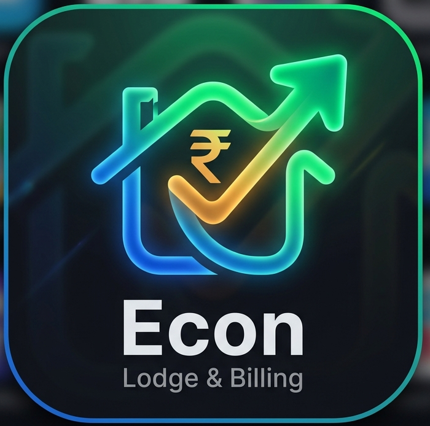

<p align="center">
  
</p>

<h1 align="center">Econ</h1>

<p align="center">
  <strong>Modern Lodge & Hotel Management System</strong>
</p>

<p align="center">
  
  
  
</p>

<p align="center">
  A lightweight native desktop application for managing lodge operations — rooms, reservations, customers, billing with GST support, and invoice printing.
</p>

---

## Features

- **Room Management** — Add rooms, define room types with default rates, track availability
- **Reservation System** — Create, check-in, check-out, and cancel reservations
- **Customer Records** — Maintain guest details with ID proof tracking
- **GST Billing** — Generate GST and Non-GST invoices with configurable invoice series
- **Invoice Printing** — Clean, modern A4 invoice layout with amount in words
- **Multi-tenant** — Each admin account has isolated data
- **Settings** — Configure lodge name, address, GSTIN, state info, and invoice numbering

## Tech Stack

| Layer | Technology |
|-------|-----------|
| **Desktop shell** | [Wails v2](https://wails.io/) (Go ↔ WebView, native window) |
| **Backend** | Go, GORM, SQLite (pure-Go driver) |
| **Frontend** | React 19, TypeScript, Tailwind CSS, Vite |

There is no HTTP server, REST API, or JWT — the React frontend calls Go directly
through generated Wails bindings (local IPC). Authentication is an in-memory
session held in the Go process.

## Project Structure

```
Econ-billing/
├── main.go               # Wails entry point (window options, bindings)
├── app.go                # App lifecycle + window controls + binding wiring
├── wails.json            # Wails project config / app metadata
├── build.ps1             # Build script -> build/bin/Econ.exe
├── internal/
│   ├── bindings/         # Wails IPC surface (auth, customer, room, …)
│   ├── services/         # Business logic (GST invoice numbering, etc.)
│   ├── repository/       # GORM/SQLite data access
│   ├── models/           # Database models
│   ├── database/         # DB open + AutoMigrate (%APPDATA%/econ/econ.db)
│   └── session/          # In-memory current-user holder
├── pkg/utils/            # Password hashing (bcrypt)
├── frontend/             # React SPA
│   ├── src/
│   │   ├── components/   # Reusable UI components (incl. window title bar)
│   │   ├── pages/        # Route pages
│   │   ├── services/     # Thin wrappers over Wails bindings
│   │   ├── lib/          # bindings.ts (binding re-exports + helpers)
│   │   └── types/        # TypeScript interfaces
│   └── wailsjs/          # AUTO-GENERATED bindings — do not edit
├── build/                # Wails build assets + output (build/bin/)
└── docs/                 # Implementation notes
```

## Prerequisites

- [Go](https://go.dev/) 1.22+
- [Node.js](https://nodejs.org/) 18+ and npm
- [Wails CLI](https://wails.io/docs/gettingstarted/installation) v2 — `wails version` should print `v2.x`
  - Install: `go install github.com/wailsapp/wails/v2/cmd/wails@latest`
- Windows: the **WebView2 runtime** (preinstalled on Windows 10/11)

## Development

From the project root:

```powershell
wails dev
```

This launches the app with hot-reload — Go changes rebuild, frontend changes
refresh live. Bindings are regenerated automatically.

## Building for Production

```powershell
# From project root
./build.ps1
```

This runs `wails generate module` then `wails build`, producing a single
self-contained executable:

```
build/bin/Econ.exe
```

Equivalent direct command:

```powershell
wails build -clean -platform windows/amd64 -o Econ.exe
```

## Running

Double-click `build/bin/Econ.exe` (or run it from a terminal). It opens its own
native window — no browser or separate server required.

The window is frameless with a custom in-app title bar providing
minimize / maximize / close controls.

## Configuration

| Variable | Default | Description |
|----------|---------|-------------|
| `REGISTRATION_TOKEN` | `919847073856` | Token required to create a new account via the in-app Sign Up screen |

Read at startup via the environment; if unset, the built-in default is used.
See [.env.example](.env.example).

## Data Storage

The SQLite database is created and migrated automatically at:

```
%APPDATA%\econ\econ.db
```

(On non-Windows platforms it falls back to `~/.config/econ/econ.db`.)

## First Run

1. Launch the application
2. Click **"Don't have an account? Sign up"** on the login screen
3. Enter the registration token: `919847073856`
4. Create your admin account
5. Go to **Settings** to configure your lodge details (name, address, GSTIN, etc.)
6. Start adding rooms, customers, and reservations.

## License

MIT
